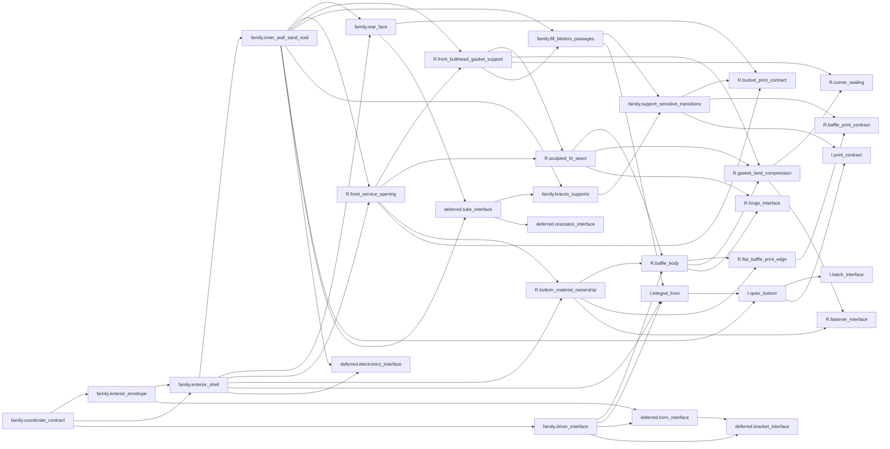

<!-- Generated by render_phase_a_reports.py from atomic_manifest.json. Do not edit by hand. -->

# Dependency graph

Authority: atom dependency and consumer fields in `atomic_manifest.json`.

Deferred external components terminate at interface atoms; no acoustic or product geometry is integrated by this map.
